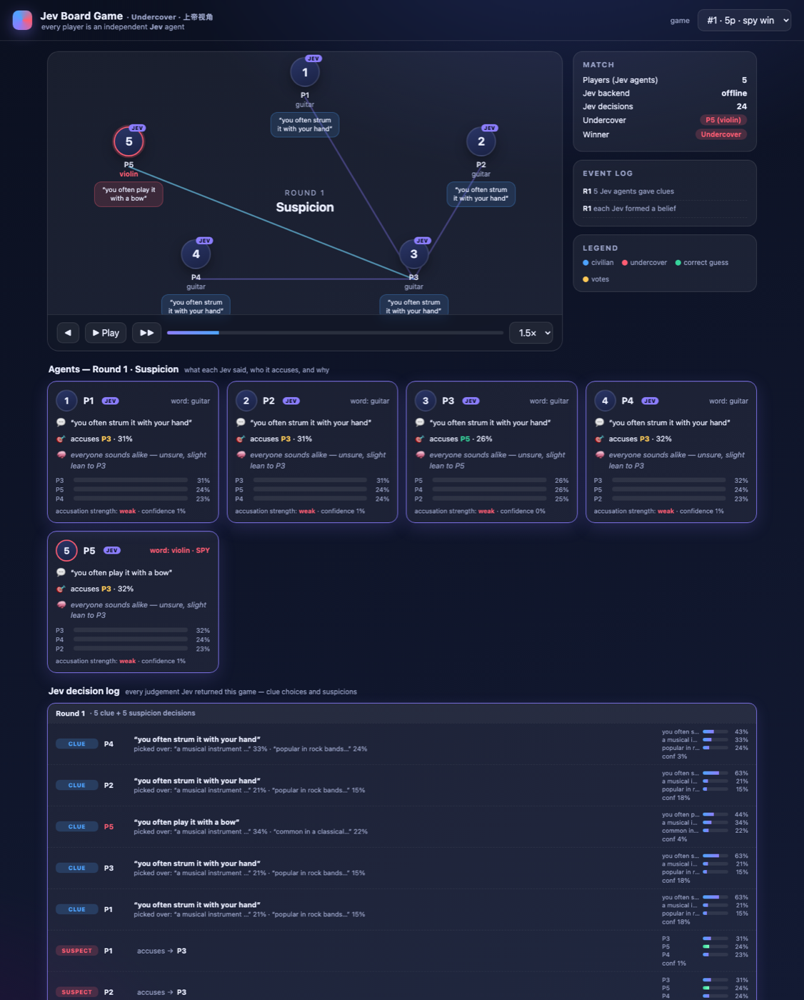
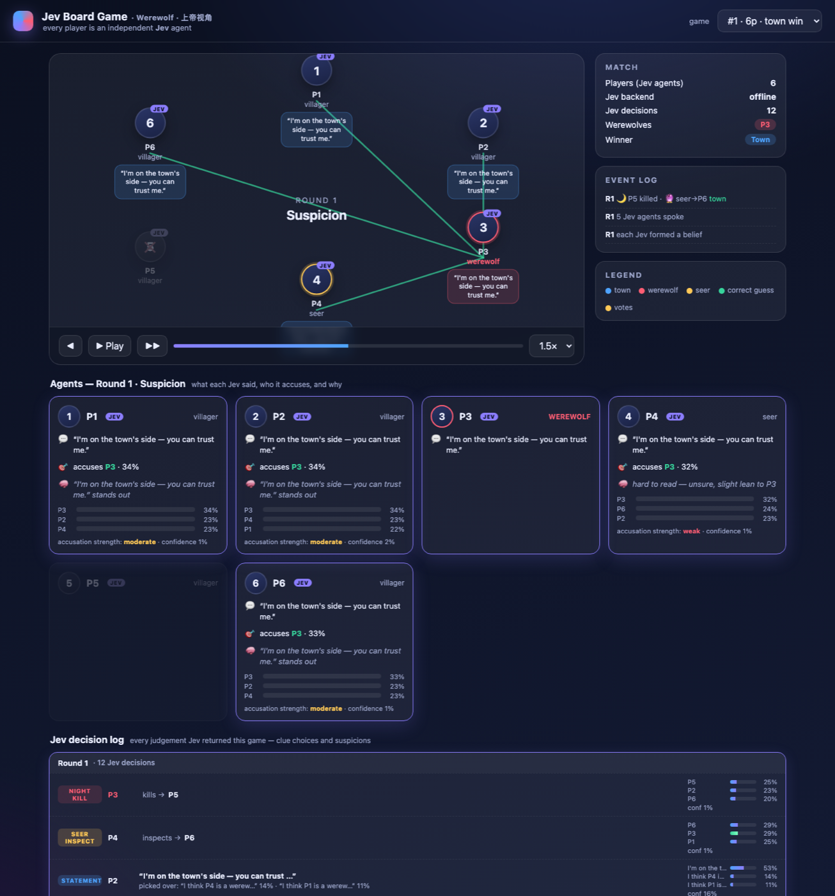
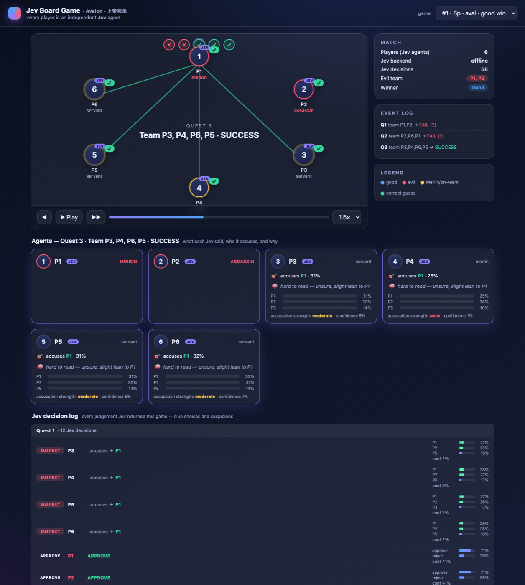

<h1 align="center">Jev Board Game</h1>

<p align="center">
  <strong>Belief as a primitive — instrumenting social-deduction games with a calibrated System-One model.</strong><br>
  Every player is an independent <a href="https://typesafe.ai"><b>Jev</b></a> agent; its suspicion is a typed, natively-calibrated probability distribution you can log, score, and watch.
</p>

<p align="center">
  <a href="https://github.com/KeWang0622/jev-board-game/actions/workflows/ci.yml"></a>
  <a href="https://github.com/KeWang0622/jev-board-game/blob/main/LICENSE"></a>
  
  
  
</p>

<p align="center"></p>

<p align="center"><b>▶ Live demo (God's-eye viewer, all three games):</b> <a href="https://kewang0622.github.io/jev-board-game/">kewang0622.github.io/jev-board-game</a></p>

---

## Why this exists

Social-deduction games (Undercover, Werewolf, Avalon) are, at their core, games of
**calibrated belief under hidden information**: each player keeps a probability over
who is lying and updates it every turn. A recent wave of work tries to recover those
beliefs from autoregressive LLMs by *probing* them or asking them to *verbalize*
confidence — and repeatedly finds that verbalized confidence is **poorly calibrated**
and must be recalibrated before it can be read as probability (see [related work](docs/related_work.md)).

This project takes the opposite route. [Jev](https://typesafe.ai) (TypeSafe's *System
One* model) does not generate text; it returns a **typed, natively-calibrated
probability distribution** as its primitive output. So instead of probing a language
model for a belief and correcting it, the belief *is* the model's direct answer:

> Each agent's suspicion is a Jev `Choice` over the other players. **That distribution
> is the belief** — logged every round and scored against ground truth for calibration
> (ECE, Brier) and belief-trajectory analysis.

`Jev Board Game` is the testbed and analysis harness for that idea.

## Status

| Game | State |
| --- | --- |
| **Undercover** (Who-Is-The-Spy) | ✅ fully implemented (reference game) |
| **Werewolf** / Mafia | ✅ fully implemented (werewolves, seer, villagers; night kill + inspect + day vote) |
| **Avalon** (The Resistance) | ✅ fully implemented (quests, approval votes, sabotage, Assassin's Merlin guess) with a quest-board web viewer |

Everything runs **offline with no API key** via a deterministic stand-in backend, so
the demo, experiments, and CI work out of the box. Set `TYPESAFE_API_KEY` to swap in
real Jev judgements.

## Install

```bash
python3 -m venv .venv && source .venv/bin/activate
pip install -e ".[dev]"          # add ",plots" for trajectory PNGs, ",live" for real Jev
```

## Quickstart

```bash
# WEB God's-eye view: bake games into a self-contained, shareable HTML file
jev-undercover --web undercover-viewer.html --games 6 && open undercover-viewer.html

# TERMINAL God's-eye view: watch one game play out (clues, suspicion, votes)
jev-undercover --watch --players 5 --seed 3

# 20 offline games with a calibration report
jev-undercover --games 20 --players 5

# sweep player count × clue-revealingness (the "how much do clues expose" knob)
jev-undercover --games 20 --players 4,5,6 --max-reveal 0,1,2

# WEREWOLF (--game werewolf works with --watch / --web / stats too)
jev-undercover --game werewolf --watch --players 6 --seed 4
jev-undercover --game werewolf --web werewolf-viewer.html --games 6 && open werewolf-viewer.html
jev-undercover --game werewolf --games 40 --players 6 --werewolves 1

# AVALON (--watch / --web / stats)
jev-undercover --game avalon --watch --players 6 --seed 5
jev-undercover --game avalon --web avalon-viewer.html --games 6 && open avalon-viewer.html
jev-undercover --game avalon --games 40 --players 6

# Cross-game calibration benchmark (offline, or --backend live with a key)
python scripts/benchmark.py --games 50

# real Jev (needs TYPESAFE_API_KEY); dump machine-readable results
jev-undercover --backend live --games 50 --players 5 --json runs/live.json
```

<p align="center"></p>

<p align="center"></p>

The web viewer shows the table with speech-bubble clues and suspicion/vote arrows, a
per-agent readout (**what each Jev said, who it accuses, its reason, and its belief
bars**), and a full **Jev decision log** of every judgement. It's a single static HTML
file — open it locally or host it anywhere; `?game=<i>&step=<n>` deep-links a moment.

> **On the offline backend.** It does not understand language; it produces stable,
> well-formed distributions from lexical heuristics (including a generic odd-one-out
> signal) so the pipeline and demo are non-trivial and reproducible. Its calibration
> numbers illustrate the *analysis*, not Jev's real accuracy — for the scientific
> result, run `--backend live`.

> **On the "reasons."** Jev returns probabilities, not prose. Each reason shown in the
> viewer is derived *faithfully* from the distribution and the clues (the accusation,
> its strength vs. a uniform guess, and the driving clue) — never a generated
> explanation.

## How it maps onto Jev primitives

| Decision | Primitive | Why |
| --- | --- | --- |
| Which clue to say (blend in) | `Choice` over the player's candidate clues | "Select, don't generate" — Jev picks from a bank; code never asks it to write text |
| Who is the spy | `Choice` over the other living players | the returned `probabilities` are the calibrated belief we log |

Two invariants keep the science honest:

1. **Agents never see their own team.** In Undercover no one is told whether their
   word is the majority or minority word, so suspicion is a genuine inference.
2. **Ground truth is analysis-only.** The true spy id is attached to each belief
   record for scoring but is never part of any agent's state.

## Architecture

```
src/jev_board_game/
  jev/          backend-agnostic client: typed Choice/Noul/Score + live & offline backends
  engine/       game contract, players/events, BeliefRecord + JevDecision (the research payload)
  games/        undercover.py (full); werewolf.py, avalon.py (scaffolds)
  agents/       jev_agent.py — clue selection + suspicion via Jev
  analysis/     calibration.py (ECE, Brier, reliability), trajectories.py
  experiment.py run many games / sweep configs and aggregate
  replay.py     terminal God's-eye view
  webexport.py  bake games into the self-contained web viewer
  web/          viewer.html
  cli.py        `jev-undercover`
```

## Development

```bash
ruff check .        # lint
mypy                # type-check (strict)
pytest              # tests (offline, deterministic)
pre-commit install  # optional: run the gates on every commit
```

See [CONTRIBUTING.md](CONTRIBUTING.md) for the design philosophy and PR checklist.

## The paper

The intended contribution and framing live in [`docs/related_work.md`](docs/related_work.md):
prior social-deduction-agent work measures win rates or probes autoregressive LLMs for
miscalibrated beliefs; here the belief is a calibrated primitive by construction, and
the game is the instrument that tests it. If you build on this, please cite it —
see [`CITATION.cff`](CITATION.cff).

## License

MIT — see [LICENSE](LICENSE).
